# All in One Travel App

## Repo Structure

```text
.
├── docs                                  # Documents Folder.
├── source                                # Contains Source Code of Mobile & Web Apps.
└── README.MD                             # Readme file.
└── LICENCE                               # Licence file.
```

## 01 Introduction
The All-In-One Travel App is a comprehensive platform designed to simplify and enhance the
travel experience in Sri Lanka. Whether a local or an international tourist, this app empowers
you to effortlessly book every aspect of your journey—from travel arrangements and
accommodations to tickets for must-see attractions—all in one place. Tailored specifically for the
vibrant destinations of Sri Lanka, the app brings together essential travel services, providing a
user-friendly, seamless interface to plan, manage, and enjoy your trip.

With features that allow you to book transportation, find top-rated hotels, and reserve tickets for
popular tourist spots, the All-In-One Travel App is the ultimate companion for a hassle-free
exploration of Sri Lanka. Each service is designed with convenience in mind, enabling you to
make reservations, view details, and manage your bookings directly from your mobile device.
Explore Sri Lanka like never before with a travel app that keeps everything organized and at
your fingertips.


## 02 Technology Stack

The Organ Donation App is built using the following technology stack:

- **Flutter**: For the mobile frontend, providing a smooth and responsive user interface for patients.
- **Laravel**: For the backend, managing server-side operations and handling API requests.
- **MySQL**: Used as the database to store and manage data related to organ requests, user information, and interactions between patients and hospitals.


## 03 Setup Backend Endpoint

To run the app successfully, we first need to set up the backend endpoint. This will allow the mobile app to communicate with the backend server for processing bookings, managing reservations, and fetching travel information.

**Backend App Source Folder:** `source/backend-app`


### Step 01: Setup database 

```
docs/all_in_one_travel.sql
```

This file comes preloaded with data specific to Sri Lanka, including hotel prices, travel costs, and other essential travel information.

Alternatively, if you prefer to start with a fresh database, you can run the following command: `php artisan migrate` However, please note that this command will create an empty database structure without any preloaded data.

### Step 02: Setup .env file

```
APP_NAME=AllInOneTravel
APP_ENV=local
APP_KEY=base64:yj7t43y+JJ+syX8zNcf+YIgEyvgIMRAm23RiDRPJavU=
APP_DEBUG=true
APP_TIMEZONE=UTC
APP_URL=http://localhost

DB_CONNECTION=mysql
DB_HOST=127.0.0.1
DB_PORT=3306
DB_DATABASE=all_in_one_travel
DB_USERNAME=root
DB_PASSWORD=
```

### Step 03: Install Dependencies

```
composer install
```

### Step 04: Generate an APP_KEY

```
php artisan key:generate
```


### Step 05: Run App

```
php artisan serve
```

## 04 Setup Mobile App

In this section, we will set up the mobile app, designed for travelers to book transportation, find accommodations, and reserve tickets for popular attractions across Sri Lanka. This mobile app provides a user-friendly experience that allows tourists to plan, manage, and enjoy their trip all in one place.


**Mobile App Source Folder:** `source/mobile-app`


### Step 01: Open the App using Android Studio

```
source/mobile-app
```

### Step 02: Clean build and caches


```
flutter clean
```

### Step 03: Install Dependencies

```
flutter pub get
```

### Step 04: Run the App

```
flutter run
```

**Important Note**: 
Ensure the Laravel backend is started before running the mobile app. Without the backend server running, the app will not be able to connect to the database or perform any backend tasks.

If you are not using localhost for the backend, update the endpoint in `lib/config.dart:`

```dart
// lib/config.dart

class Config {
  static const String baseUrl = 'http://10.0.2.2:8000/api';
}

```

We are using Laravel as the backend framework to manage database interactions and server-side functionalities. Ensure the Laravel backend is started before running the mobile app. Without the backend server running, the app will not be able to connect to the database or perform any backend tasks.


## 05 Demo

### 5.1 Get Started

<p align="center">
  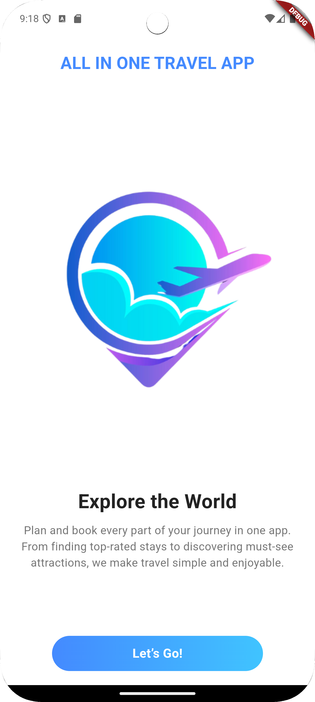
  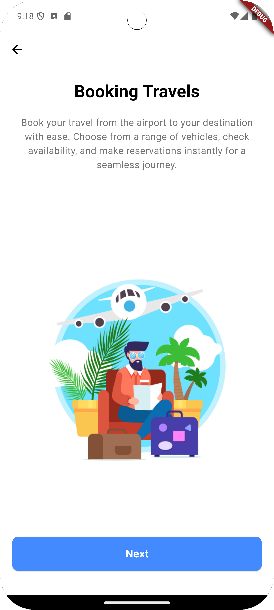
  </p>
<p align="center">
  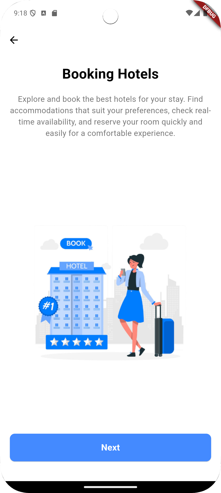
  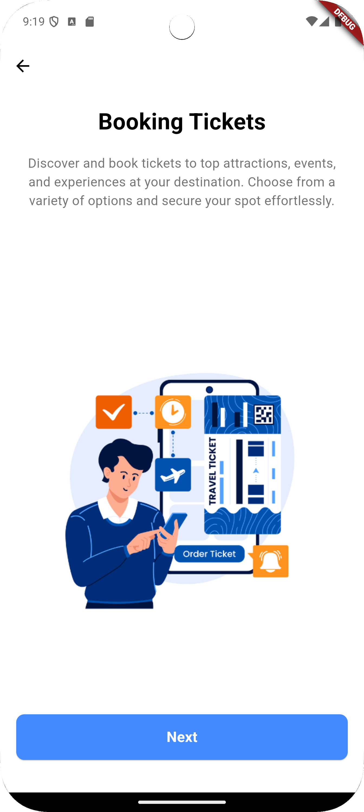
  
</p>

<p align="center">
  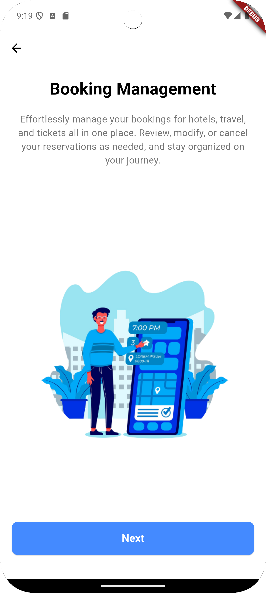  
</p>


### 5.2 Auth Screens


<p align="center">
 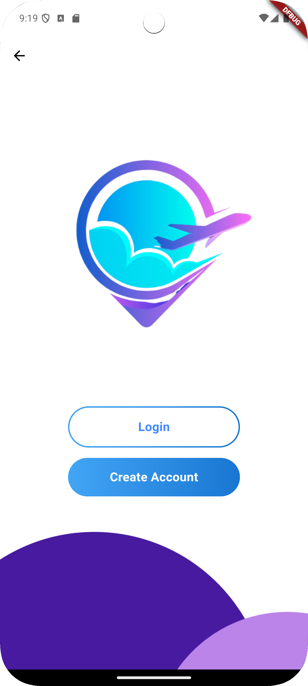  
 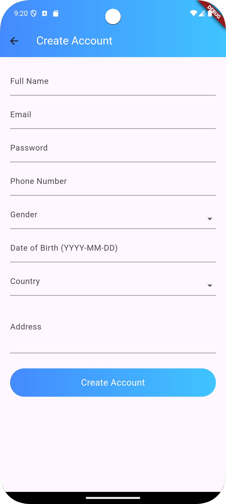  
</p>


<p align="center">
 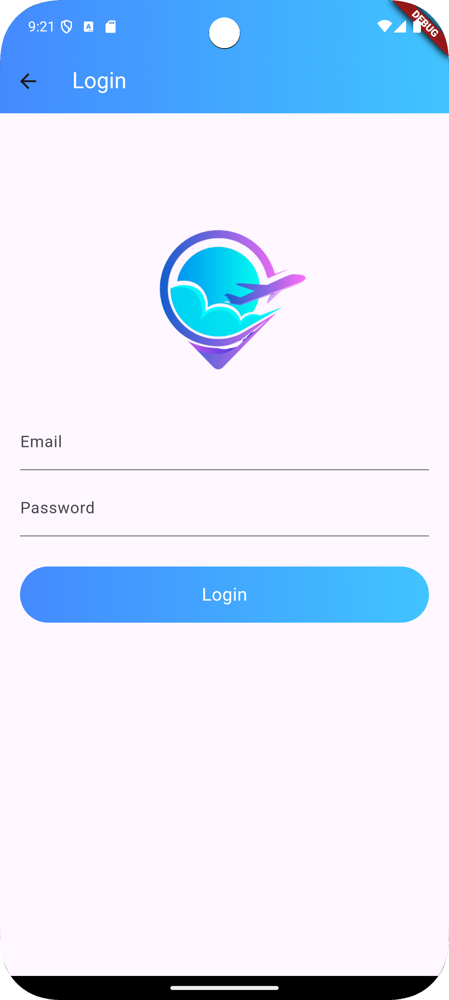  
</p>


### 5.3 Dashboard Screens

<p align="center">
 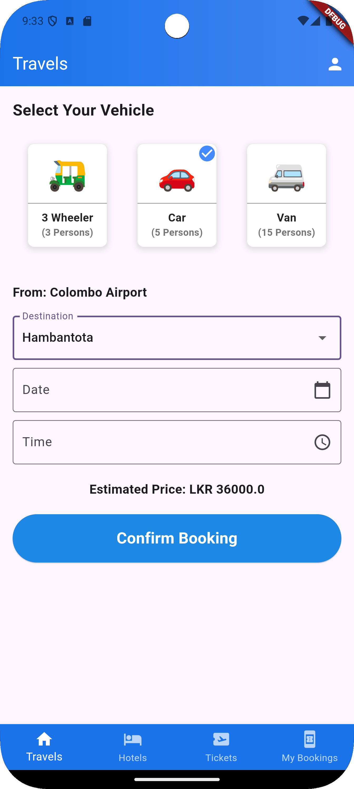  
  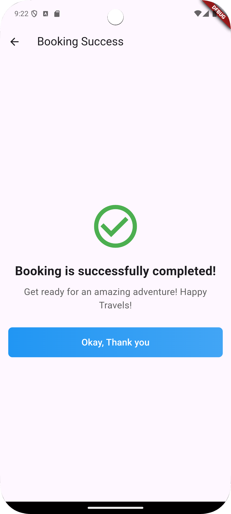  
</p>

<p align="center">
 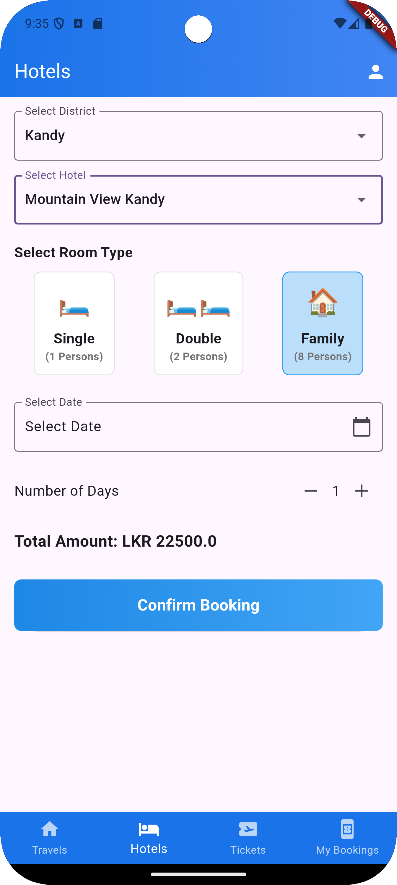  
  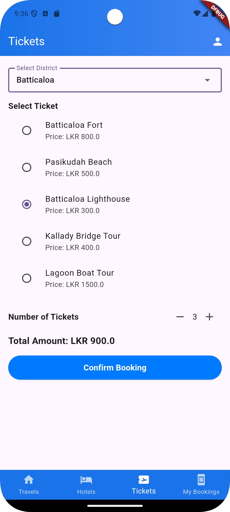  
</p>


<p align="center">
 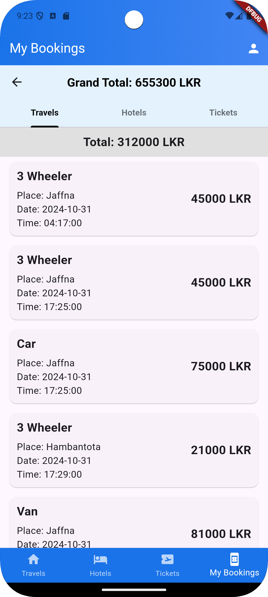  
  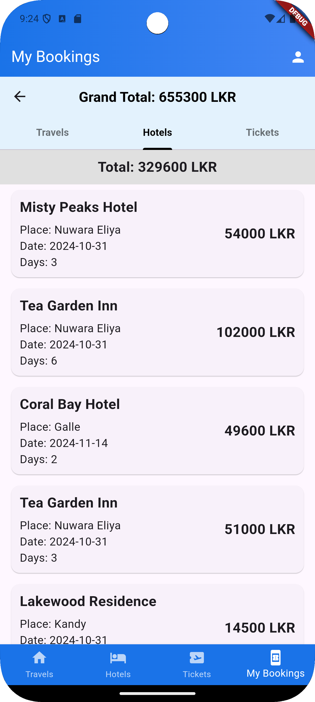  
</p>

<p align="center">
 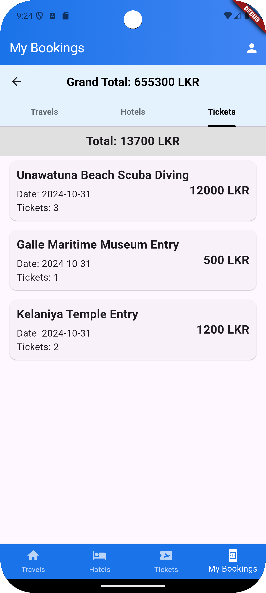  
</p>


### 5.4 Profile Screens

<p align="center">
 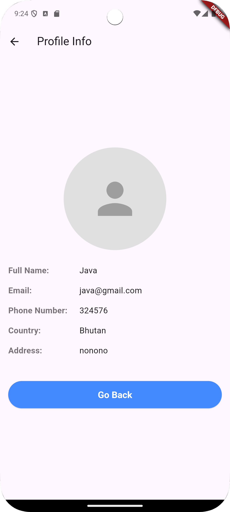  
  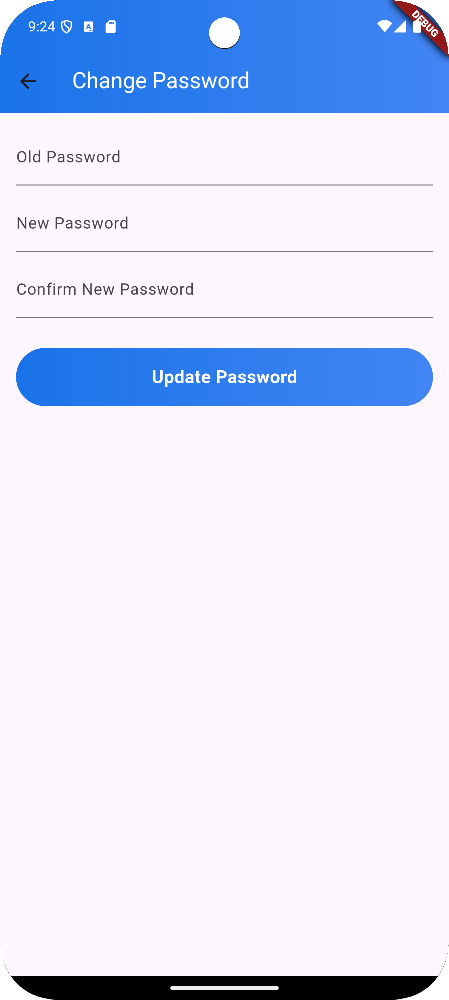  
</p>


# Contact

### 🌐 Website:
[](https://www.mpowerr.com)

---

### 📱 Social Media:

[](https://www.linkedin.com/company/mpowerr-info)
[](https://www.facebook.com/mpowerr.info)
[](https://www.instagram.com/mpowerr.info)
[](https://x.com/MpowerrInfo)
[](https://www.tiktok.com/@mpowerr.info)
[](https://www.youtube.com/@mpowerrinfo)

---
